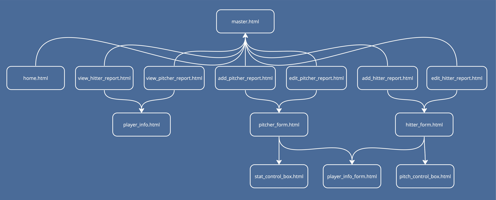
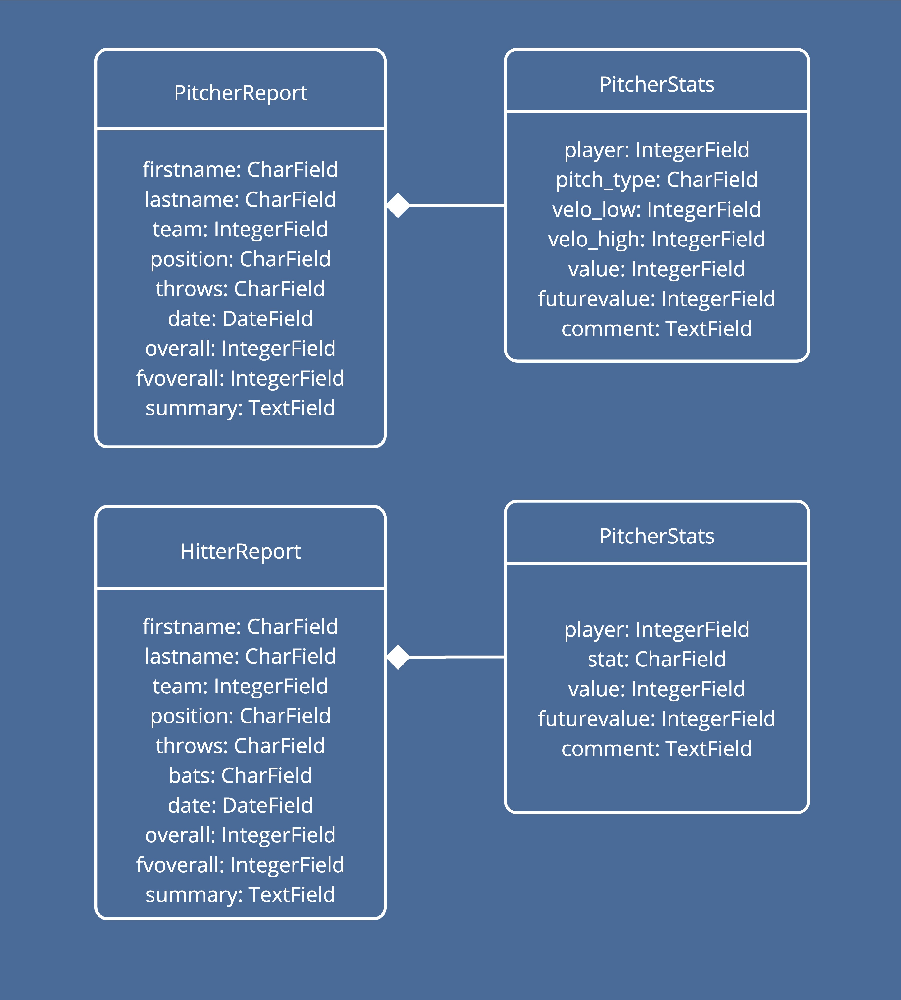

# Scout
scout is an app to help baseball scouts manage their reports and notes on players. It is built using Django for the Blue Jays.

## Installation
1. Clone the repository
1. run `source blue-jays-venv/bin/activate` to activate the virtual environment
1. Install the requirements using `pip install -r requirements.txt`
1. Run the server using `python manage.py runserver`

## Tutorial
This project is a proof of concept so it includes all the necessary features to work, but is not fully featured. Please see our section on limitations and future work for more information.

There are two types of reports: a hitter report and a pitcher report. Each report has player info, including team, batting and throwing handedness (only throwing for pitchers), and their position. A hitter report includes a 20-80 rating for each of the 5 major tools (hit, power, run, field, and throw). A pitcher report includes a 20-80 rating for each of the 4 of their pitches.

To create a report, click on the "Create New Report" button next to either the hitting report table or pitching report table, fill out the info, and submit. You can then view these reports on the tables, and see a breakdown of the player.

## Video Demo

## Technical Considerations

### Framework Choice
For this project, we chose to use Django as the framework to serve our webpages due to its use of python combined with its ease of developer tooling to spin up this app fast. Other choices considered were Flask, Ruby on Rails, and Node.JS but ultimately we chose this to get the app up and running quickly within the specified requirements.

### Component Breakdown
To follow as closely to DRY Prinicples as possible, we broke down common elements into components, and used Django's templating language to render these components. This can be seen in the following diagram.

As you can see, we have a lot of reusable components that helped us with making sure we didn't duplicate code.

### Model Design
The following diagram shows the model design for this project.

### Third Party Libraries
For this project we wanted to keep the use of third party libraries lean. We only used urllib for parsing urls and bootstrap for the design. We chose to use bootstrap because it is a well known and well documented library that is easy to use and implement, and includes mobile optimizations.

### Notable Requirement Changes
We stuck to the given requirements as close as possible, and when we were unsure of a requirement, we took a best guess and determined which approach would be best for the user. The following are notable requirement changes:

- On the forms we split the name field into firstname and lastname. This is because it is more intuitive for the user to have separate fields for each name, and it is easier to parse the name into first and last name for the database, while also allowing for customizations including search.
- We added a delete confirmation page to prevent accidental deletion of reports.
- Pitcher reports also include a view similar to the hitter report view, but with the pitcher's pitches instead of the 5 tools.
- When a pitcher doesn't have a fastball, we opted to put 'N/A' on the home table instead of not allowing the report to be created. This is because a scout may not always get to see a fastball, and a report from [FiveThirtyEight](https://fivethirtyeight.com/features/why-some-mlb-pitchers-are-abandoning-the-fastball/) shows that some pitchers are abandoning the fastball altogether.

## Limitations and Future Work
It is important to note the following is a proof of concept for an app of this sort, but is notably missing some features and has some technical considerations we would like to fix. The following is a list of limitations and future work:
- The current models repeat themselves a lot, and ideally we would like to add more safeguards while also making the models more DRY. This would include combing the two report models together, and only allowing reports with the specified type field to be linked to the respective stat field.
- Form validation: While we do have form validation, one of the limitations is data loss on submit. We would like to set up forms better to prevent this.
- Further componentization: Some components are reused heavily in code (i.e. the 20-80 input selects) and we would like to make these components more generic and reusable.
- Use of ModelForms and CrispyForms: In our research when creating this project, we found that Django has a built in way to create forms from models, and CrispyForms is a library that helps with the styling of these forms. We would like to implement these to make the forms more DRY and easier to style.
